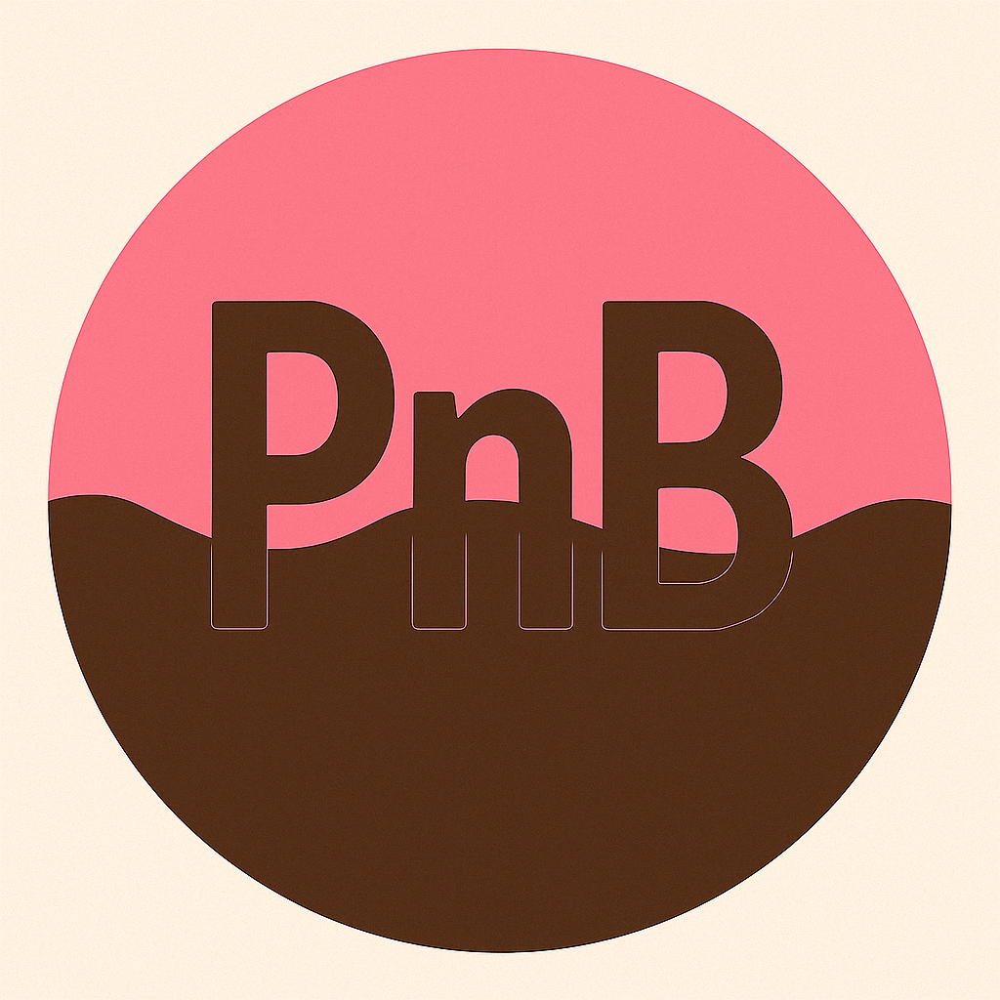

# PnB Token – Official Repository

**Contract Address (BSC):**  
`0xA721dD94f376cE50F6b0571Fc2d2CB015710e90d`

**Decimals:** 18  
**Symbol:** PNB  
**Network:** Binance Smart Chain (BSC)

---

## What is PnB?

PnB Token is a meme-driven, community-powered token built on the BSC network – created for fun, fueled by connection, and aimed at the moon. 🌕🚀

---

## Logo

  

---

## Contact

📧 Email: pnbtokenofficial@gmail.com  
🌐 Website: (
